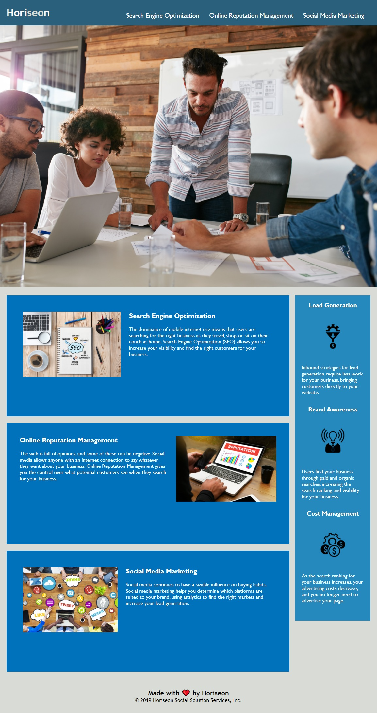

# Horiseon_WK1_KC
-Week 1 Homework 
-Transfer codes for both HTML&CSS 
-Download images, rename them 
-Correct the semantic structure 
-Input: header, nav, main, article, section and aside 
-GitHub url= https://github.com/kenchenpcpm/Horiseon_WK1_KC/ 
-Gitpage url= https://kenchenpcpm.github.io/Horiseon_WK1_KC/ 
 